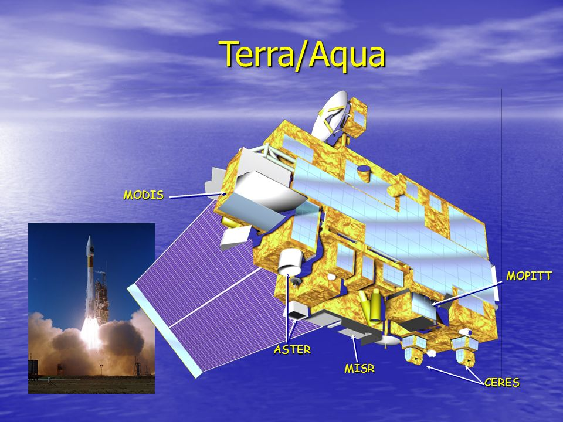
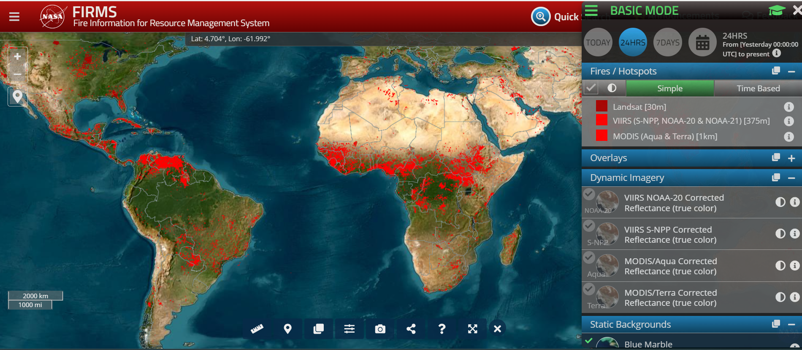
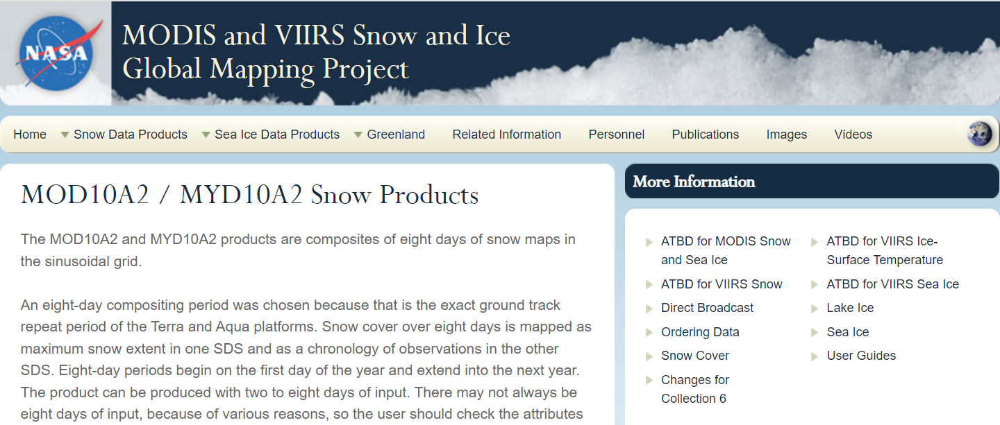

```{r setup, include=FALSE}
options(htmltools.dir.version = FALSE)
# xaringan:::list_css()
```

```{r echo = FALSE, message=FALSE, warning=FALSE}
library(countdown)
library(xaringan)
library(xaringanExtra)
library(knitr)
hook_source <- knitr::knit_hooks$get('source')
knitr::knit_hooks$set(source = function(x, options) {
  x <- stringr::str_replace(x, "^[[:blank:]]?([^*].+?)[[:blank:]]*#<<[[:blank:]]*$", "*\\1")
  hook_source(x, options)
})
xaringanExtra::use_broadcast()
xaringanExtra::use_freezeframe()
xaringanExtra::use_scribble()
#xaringanExtra::use_slide_tone()
xaringanExtra::use_search(show_icon = TRUE, auto_search	=FALSE)
xaringanExtra::use_freezeframe()
xaringanExtra::use_clipboard()
xaringanExtra::use_tile_view()
xaringanExtra::use_panelset()
xaringanExtra::use_editable(expires = 1)
xaringanExtra::use_fit_screen()
xaringanExtra::use_extra_styles(
  hover_code_line = TRUE,         
  mute_unhighlighted_code = TRUE  
)
```


# SUMMARY

##WHAT IS MODIS?

* MODIS (or **Moderate Resolution Imaging Spectroradiometer**) is a key instrument aboard the Terra  and Aqua  satellites. 

* Terra's orbit around the Earth is timed so that it passes from **north to south** across the equator in the morning, while Aqua passes **south to north** over the equator in the afternoon. 

* Terra MODIS and Aqua MODIS are viewing the entire Earth's surface every **1 to 2 days**, acquiring data in **36 spectral bands**, or groups of wavelengths. 

* With its wide spectral range, aids in various studies such as **vegetation health**, **land use changes**, **ocean studies**, **sea temperature**, and **cloud analysis**.

* MODIS is widely used for real-time and near **real-time monitoring of fires**, **natural hazards**, and **oil spills**. 


---
#MODIS SATELLITE PLATFORM

.pull-left[

```{r echo=FALSE, out.width='100%', fig.align='centre'}

```

]

.pull-right[
## TERRA
  Terra explores the connections between Earth’s atmosphere, land, snow and ice, ocean, and energy balance to understand Earth’s climate and climate change and to map the impact of human activity and natural disasters on communities and ecosystems


## AQUA
  
  NASA's Aqua satellite collects extensive data on Earth's water cycle, including aspects like evaporation, precipitation, and ice cover. It also measures additional variables such as energy fluxes, aerosols, vegetation cover, and temperatures of air, land, and water.
]
  

---
#Modis Component

.pull-left[
```{r echo=FALSE, out.width='100%', fig.align='centre'}
knitr::include_graphics('img/modisComponents.jpg')
```
]
.pull-right[

The MODIS instrument has been designed and developed since the Engineering Model (EM) was completed in mid-1995.

Since then, two spaceflight units, the Protoflight Model (PFM) (aboard the Terra Satellite) ,

and the Flight Model 1 (FM1) (aboard the Aqua Satellite) have been completed and launched. 

Terra was launched on December 18, 1999, and Aqua was launched on May 4, 2002. ]


---
#Examples of Latest Images taken by MODIS


.pull-left[

```{r echo=FALSE, out.width='100%', fig.align='left'}
knitr::include_graphics('img/SnowinUK.jpg')
```
]
.pull-right[

**Snow in the United Kingdom**

On January 17,MODIS on NASA’s Terra satellite acquired a false-color image of snow across the United Kingdom. The snow appears bright blue, vegetation is electric green, water looks dark blue. Cloud usually appears white, but high, cold clouds carrying ice crystals may be tinted bright blue.

**Image Facts**
**Satellite**: Terra
**Date Acquired**: 1/17/2024
**Resolutions**: 1km (378.6 KB), 500m (875.8 KB), 250m (1.5 MB)
**Bands Used**: 7,2,1
**Image Credit**: MODIS Land Rapid Response Team, NASA GSFC
]

---


.pull-left[
```{r echo=FALSE, out.width='100%', fig.align='left'}
knitr::include_graphics('img/image01172024_main.jpg')
```
]

.pull-right[
**Tropical Cyclone Belal**

In January 2024, Tropical Cyclone Belal lashed Réunion and Mauritius, islands in the southwest Indian Ocean east of Madagascar, with torrential rain and flooding.

**Image Facts**
**Satellite**: Aqua
**Date Acquired**: 1/14/2024
**Resolutions**: 1km (734.9 KB), 500m (2 MB), 250m (3.7 MB)
**Bands Used**: 1,4,3
**Image Credit**: MODIS Land Rapid Response Team, NASA GSFC
]
---
#MODIS DATA PRODUCTS

.pull-left[
```{r echo=FALSE, out.width='100%', fig.align='centre'}

```

```{r echo=FALSE, out.width='100%', fig.align='centre'}

```

]

.pull-right[
##MODIS Burned Area Product
The Fire Information for Resource Management System (FIRMS) distributes Near Real-Time (NRT) active fire data from the MODIS aboard the Aqua and Terra satellites.

The MODIS active fire product **detects fires in 1-km pixels** that are burning at the time of overpass under relatively cloud-free conditions using a contextual algorithm.

##MODIS Sea Ice and Ice Surface Temperature
These Level 2 and 3 products provide sea ice IST, or ice surface temperture, at 1-km (Level 2) and 0.5° (Level 3) resolutions over the global oceans.

]


---
#APPLICATIONS

The MODIS has features, which make it particularly suitable to earth characterization purposes. MODIS has 10 products dedicated mainly to land cover characterization and provides three kinds of data: angular, spectral and temporal.

MODIS presents unique features do not present in other sensor: it has an ample variety of products including reflectance data, vegetation indices, biophysical variables, and thematic products which describe land cover characteristics. Moreover, the quality assessment per pixel information is an innovative feature potentially very useful to apply preprocessing procedures to select, transform, and/or filter the data. However, such information is not commonly applied: we only observed its use in preprocessing procedures to screen data or interpolate data gaps (colditz2008). 

The limitation in its use is likely since the information contained in the QA is not totally trustworthy to identify pixels with low quality as reported by various authors (Xiao 2005, Garcı´a-Mora and Mas 2011).

Due to its coarse spatial resolution MODIS cannot replace medium spatial resolution data such as that provided by Landsat and other higher resolution sensors, but it can present a useful complement, for example, filling the time-gap between two mapping efforts based upon high resolution imagery.


---


#REFLECTION


So, this week we studied various types of sensors and their usage and limitations. I chose MODIS sensor which has many advantages and can be used for different type of surfaces like land-use, air-quality, vegetation temporal data and we can also monitor different types of climate changes. 

It can calculate the sea surface temperature and help in aerosol measurements.

MODIS has been around for approximately two decades and hence offers image comparisons over a longer timeframe compared to satellites that were launched more recently. Furthermore, MODIS has a large range of use cases such as observing changes in the polar ice cap, pollution, urban heat island effect and bio geochemistry.


---
#REFERENCES

Modis web, NASA. Available at: https://modis.gsfc.nasa.gov/

Colditz, Rene. (2008). Time Series Generation and Classification of MODIS Data for Land Cover Mapping. 

García-Mora, T.J., Mas, J.-F. and Hinkley, E.A. (2012) ‘Land cover mapping applications with Modis: A Literature Review’, International Journal of Digital Earth, 5(1), pp. 63–87. doi:10.1080/17538947.2011.565080. 

MODIS Active Fire and Burned Area Products - Home. Available at: https://modis-fire.umd.edu/ (Accessed: 16 March 2024). 

Earth Science Data Systems, N. (no date) Modis, NASA. Available at: https://www.earthdata.nasa.gov/sensors/modis (Accessed: 16 March 2024). 

