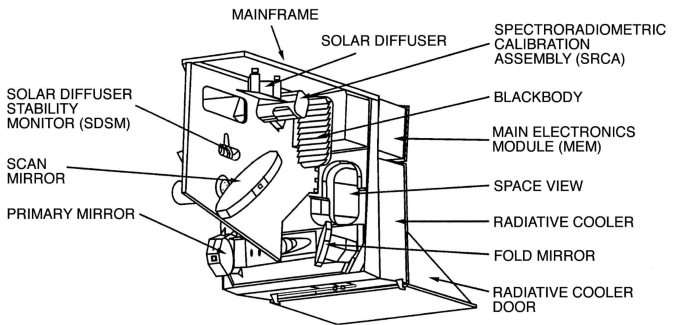
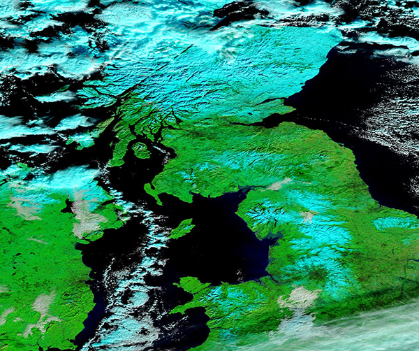
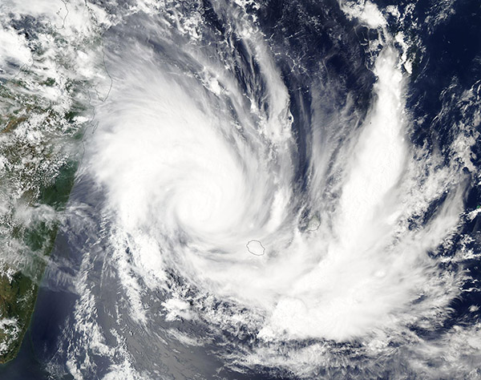
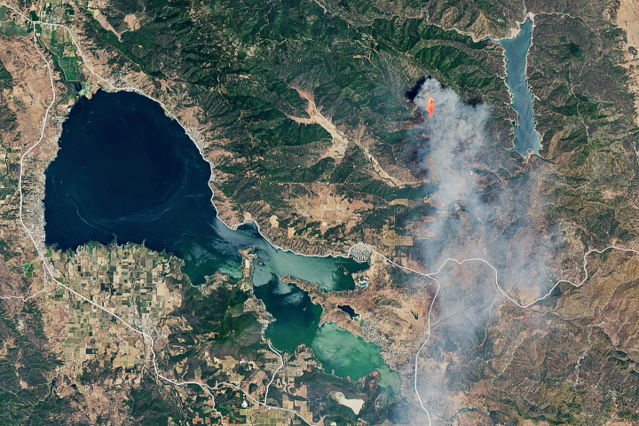

# SUMMARY

***WHAT IS MODIS ?***

* MODIS (or Moderate Resolution Imaging Spectroradiometer) is a key instrument aboard the Terra (originally known as EOS AM-1) and Aqua (originally known as EOS PM-1) satellites. 

* Terra's orbit around the Earth is timed so that it passes from north to south across the equator in the morning, while Aqua passes south to north over the equator in the afternoon. 

* Terra MODIS and Aqua MODIS are viewing the entire Earth's surface every 1 to 2 days, acquiring data in 36 spectral bands, or groups of wavelengths. 

* Its exceptionally broad spectral range enables MODIS data to be used in studies across numerous disciplines, including vegetative health, changes in land cover and land use, oceans and ocean biology, sea surface temperature, and cloud analysis.

* It also is used extensively for monitoring fires and natural hazards along with oil spills. An important attribute of MODIS data is the availability of MODIS data products in real-time and near real-time. 

```{r setup, include=FALSE}
options(htmltools.dir.version = FALSE)
```

---
***MODIS SATELLITE PLATFORM***

  ## Terra
  Terra explores the connections between Earth’s atmosphere, land, snow and ice, ocean, and energy balance to understand Earth’s climate and climate change and to map the impact of human activity and natural disasters on communities and ecosystems
  
  ##Aqua
  Aqua, Latin for water, is a NASA Earth Science satellite mission named for the large amount of information that the mission is collecting about the Earth's water cycle, including evaporation from the oceans, water vapor in the atmosphere, clouds,precipitation, soil moisture, sea ice, land ice, and snow cover on the land and ice. Additional variables also being measured by Aqua include radiative energy fluxes, aerosols, vegetation cover on the land, phytoplankton and dissolved organic matter in the oceans, and air, land, and water temperatures.
  

  
video: https://terra.nasa.gov/wp-content/uploads/2019/12/13493_Terra_Instruments_20Anniversary_FINAL_VX-309498_lowres.mp4

---
***Modis Component***

.pull-left[
```{r echo=FALSE, out.width='100%', fig.align='left'}

```
]
.pull-right[The MODIS instrument has been designed and developed since the Engineering Model (EM) was completed in mid-1995. Since then, two spaceflight units, the Protoflight Model (PFM) (aboard the Terra Satellite) , and the Flight Model 1 (FM1) (aboard the Aqua Satellite) have been completed and launched. Terra was launched on December 18, 1999, and Aqua was launched on May 4, 2002. ]

.pull-left[**Data Collection**

MODIS data can be found from the information sites listed below.

[data](https://search.earthdata.nasa.gov/search?portal=idn&fi=MODIS)]

.pull-left[
[CLOUD](http://ladsweb.nascom.nasa.gov/)

[LAND](https://lpdaac.usgs.gov/)

[cryosphere](http://nsidc.org/daac/modis/index.html)

[SEA](http://oceancolor.gsfc.nasa.gov/) ]

---
***Examples of Latest Images taken by MODIS*** 


.pull-left[

```{r echo=FALSE, out.width='100%', fig.align='left'}

```
]
.pull-right[

**Snow in the United Kingdom**

On January 17, the Moderate Resolution Imaging Spectroradiometer (MODIS) on NASA’s Terra satellite acquired a false-color image of snow across the United Kingdom. In this type of image, snow appears bright blue, vegetation is electric green, water looks dark blue. Cloud usually appears white, but high, cold clouds carrying ice crystals may be tinted bright blue.

**Image Facts**
**Satellite**: Terra

**Date Acquired**: 1/17/2024
**Resolutions**: 1km (378.6 KB), 500m (875.8 KB), 250m (1.5 MB)
**Bands Used**: 7,2,1
**Image Credit**: MODIS Land Rapid Response Team, NASA GSFC
]

---


.pull-left[
```{r echo=FALSE, out.width='100%', fig.align='left'}

```
]

.pull-right[
**Tropical Cyclone Belal**

In January 2024, Tropical Cyclone Belal lashed Réunion and Mauritius, islands in the southwest Indian Ocean east of Madagascar, with torrential rain and flooding.
The Moderate Resolution Imaging Spectroradiometer (MODIS) on NASA’s Aqua satellite acquired this true-color image of the storm on January 14.

**Image Facts**
**Satellite**: Aqua
**Date Acquired**: 1/14/2024
**Resolutions**: 1km (734.9 KB), 500m (2 MB), 250m (3.7 MB)
**Bands Used**: 1,4,3
**Image Credit**: MODIS Land Rapid Response Team, NASA GSFC
]
---


.pull-right[
**Pawnee Fire, Northern California**
Temperature, humidity, and winds contributed to the rapid spread of fire in Lake County, about 100 miles northwest of Sacramento.]

.pull-left[
```{r echo=FALSE, out.width='100%', fig.align='left'}

```
]
---
###APPLICATIONS

The MODIS has features, which make it particularly suitable to earth characterization purposes. MODIS has 10 products dedicated mainly to land cover characterization and provides three kinds of data: angular, spectral and temporal. MODIS data also includes information about the data quality through the ‘Quality Assessment’ product.

MODIS presents unique features do not present in other sensor: it has an ample variety of products including reflectance data, vegetation indices, biophysical variables, and thematic products which describe land cover characteristics. Moreover, the quality assessment per pixel information is an innovative feature potentially very useful to apply preprocessing procedures to select, transform, and/or filter the data. However, such information is not commonly applied: we only observed its use in preprocessing procedures to screen data or interpolate data gaps (colditz2008). 

The limitation in its use is likely since the information contained in the QA is not totally trustworthy to identify pixels with low quality as reported by various authors (Xiao 2005, Garcı´a-Mora and Mas 2011).

Due to its coarse spatial resolution MODIS cannot replace medium spatial resolution data such as that provided by Landsat and other higher resolution sensors, but it can present a useful complement, for example, filling the time-gap between two mapping efforts based upon high resolution imagery.


---
###REFLECTIONS

So, this week we studied various types of sensors and their usage and limitations.I chose MODIS sensor which has many advantages and can be used for different type of surfaces like land-use, air-quality, vegetation temporal data and we can also monitor different types of climate changes. It can calculate the sea surface temperature and help in aerosol measurements.
It is a rotating-mirror scanner which carries 36 bands in the UV, visible, and IR ranges, suitable for atmospheric, terrestrial, and ocean remote sensing.


---
***REFRENCES***

@article{article,
author = {Colditz, Rene},
year = {2008},
month = {01},
pages = {},
title = {Time Series Generation and Classification of MODIS Data for Land Cover Mapping}
}
```{r echo=FALSE}
library(RefManageR)
BibOptions(check.entries = FALSE,
           bib.style = "authoryear",
           cite.style = "authoryear",
           style = "markdown",
           hyperlink = TRUE,
           dashed = FALSE,
           no.print.fields=c("doi", "url", "urldate", "issn"))
myBib <- ReadBib("./My Library.bib", check = FALSE)
```

```{r echo=FALSE}
options(repos = c(CRAN = "https://cran.r-project.org"))
```


```{r results='asis', echo=FALSE}
'r Citet(myBib,"wulderOpeningArchiveHow2012")'

```


```{r  echo=FALSE}

PrintBibliography(myBib, start = 1, end = 7)
```
